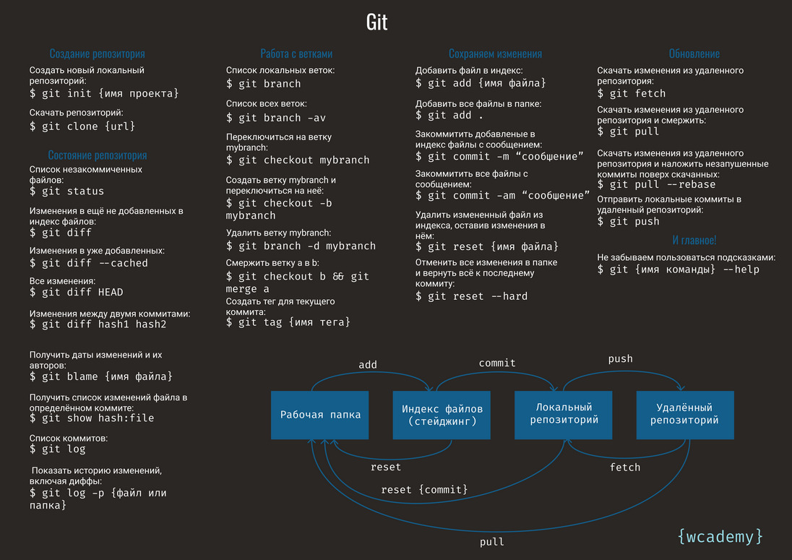

# CONNECT GITHUB WITH SSH

## Checking for existing SSH keys

- 1. Open Git Bash.

- 2. Enter ```ls -al ~/.ssh``` to see if existing SSH keys are present.
```bash
	$ 																																																																						
```
	Lists the files in your .ssh directory, if they exist
	
- 3. Check the directory listing to see if you already have a public SSH key. By default, the filenames of supported public keys for GitHub are one of the following.

id_rsa.pub
id_ecdsa.pub
id_ed25519.pub
Tip: If you receive an error that ~/.ssh doesn't exist, you do not have an existing SSH key pair in the default location. You can create a new SSH key pair in the next step.

## Either generate a new SSH key or upload an existing key.

- 1. Open Git Bash.

- 2. Paste the text below, substituting in your GitHub email address.
```bash
ssh-keygen -t ed25519 -C "litrovkin@yandex.ru"
```
Note: If you are using a legacy system that doesn't support the Ed25519 algorithm, use:
```bash
$ ssh-keygen -t rsa -b 4096 -C "litrovkin@yandex.ru"
```

## Adding your SSH key to the ssh-agent

- 1. Ensure the ssh-agent is running. You can use the "Auto-launching the ssh-agent" instructions in "Working with SSH key passphrases", or start it manually:
```
# start the ssh-agent in the background
$ 	
> Agent pid 59566
```
- 2. Add your SSH private key to the ssh-agent. If you created your key with a different name, or if you are adding an existing key that has a different name, replace id_ed25519 in the command with the name of your private key file.
```
$ ssh-add ~/.ssh/id_ed25519
```

## Adding a new SSH key to your GitHub account

- 1. Copy the SSH public key to your clipboard
```
$ clip < ~/.ssh/id_ed25519.pub
# Copies the contents of the id_ed25519.pub file to your clipboard
```
- 2.	Перейдите на: https://github.com/settings/profile 
- 3.	Найти опцию “SSH and GPG keys” → кнопка “New SSH key”
- 4.	Добавляете свой SSH-ключ(он у вас в буфере) и даете название(произвольное)

## Testing your SSH connection

- 1. Open TerminalTerminalGit Bash.

- 2. Enter the following:
```
$ ssh -T git@github.com
# Attempts to ssh to GitHub
Hi litr05! You've successfully authenticated, but GitHub does not provide shell access.
```
# работа с GIT репозиторием




- 1.	```git init``` - инициализация(создание) репозитория
- 2.	Создаем .gitignore - прописывая в него файлы и папки, которые не должны попасть в репозиторий.
- 3.	```git add .``` - добавляем все файлы проекта(кроме тех, что в .gitignore). Подготавливаем файлы к коммиту)сохранению)
- 4.	```git commit -m “комментарий к коммиту”```  - делаем коммит(сохраняем текущее состояние файлов в репозитории)
- 5.	Регистрируемся на https://github.com/ и создаем там новый репозиторий (зеленая кнопочка New в правом верхнем углу)
- 6.	Выполняем две последние команды:
		```
		git remote add origin git@github.com:litr05/shpor.git
		git push -u origin main
		```
- 7.	```git pull origin master``` - забрать изменения с удаленного репозитория
- 8.	```git push origin master``` - отправить изменения на удаленный репозиторий

## create a new repository on the command line
```
echo "# litr05" >> README.md
git init
git add README.md
git commit -m "first commit"
git branch -M master
git remote add origin git@github.com:litr05/litr05.git
git push -u origin master
```
## …or push an existing repository from the command line
```
git remote add origin git@github.com:litr05/ansible.git
git branch -M master
git push -u origin master
```


# Заметки по GIT

- 1. Configurate
```
git config --global user.name "Litr05"
git config --global user.email "litrovkin@yandex.ru>"
git config --global core.autocrlf input
git config --global core.safecrlf true
```

```git init``` - создает в директории пустой репозиторий в виде директории .git, где и будет в дальнейшем храниться вся информация об истории коммитов, тегах — о ходе разработки проекта

```git add <filename>``` - позволяет внести в индекс (временное хранилище) изменения, которые затем войдут в коммит

```git commit -a``` - совершит коммит, автоматически индексируя изменения в файлах проекта. Новые файлы при этом индексироваться не будут! Удаление же файлов будет учтено.
```git commit -m «commit comment»``` - комментируем коммит прямо из командной строки вместо текстового редактора.
```git commit --amend -m "comment"``` - замена предыдущего коммита новым

```git commit <FILENAME>``` - внесет в индекс и создаст коммит на основе изменений единственного файла.

```git status```  - проверить текущее состояние репозитория

```git checkout <hash>``` - позволяет переключаться между последними коммитами 
```git checkout <brunch_name>``` - переключиться между ветками
```git checkout <tag_name>```
```git checkout <tag_name>^``` - перейти на версию предшествующую <tag_name>
```git checkout master``` - возвращение к последней версии в ветке master
```git checkout <file_name>``` - для переключения в версию файла <file_name> в репозитории

```git tag <tag_name>``` - установка тега/метки
```git tag``` - можно посмотреть, какие теги доступны 

```git reset HEAD <filename>``` - сброс индекса(git add) с указанного файла

```git revert HEAD``` - изменение коммита

```git log``` - список произведенных изменений
```git log --pretty=oneline``` - однострочная история
```git checkout -f```  - затереть изменения
```git checkout -b <name>``` - задать имя ветки(нужно находиться на последнем коммите ветки)
	
```git branch -D <branch_name>``` - удалить ветку 
```git merge --no-ff``` - принудительный коммит при fast-forward merge
```git clone git://github.com/schacon/grit.git mygrit```
```git push origin master --force```
```git checkout -f master```

Мои алиасы: $nano ~/.gitconfig
[alias]
hist = log --pretty=format:\"%h %ad | %s%d [%an]\" --graph --date=short
st = status
co = checkout

